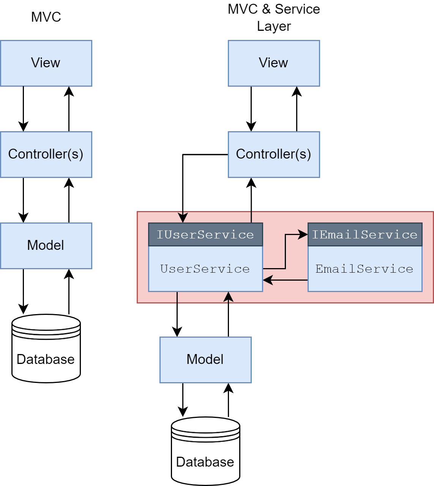
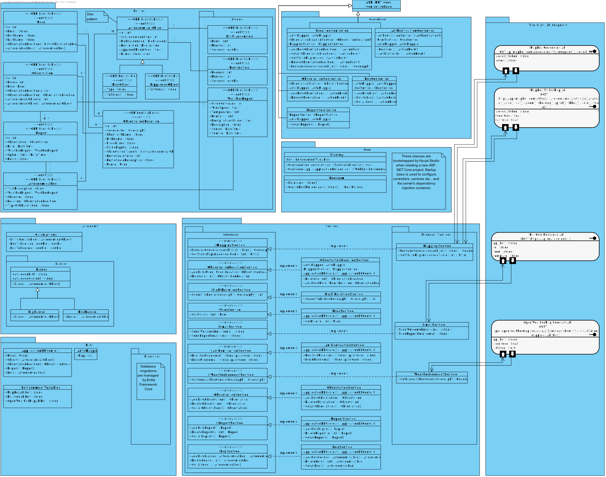
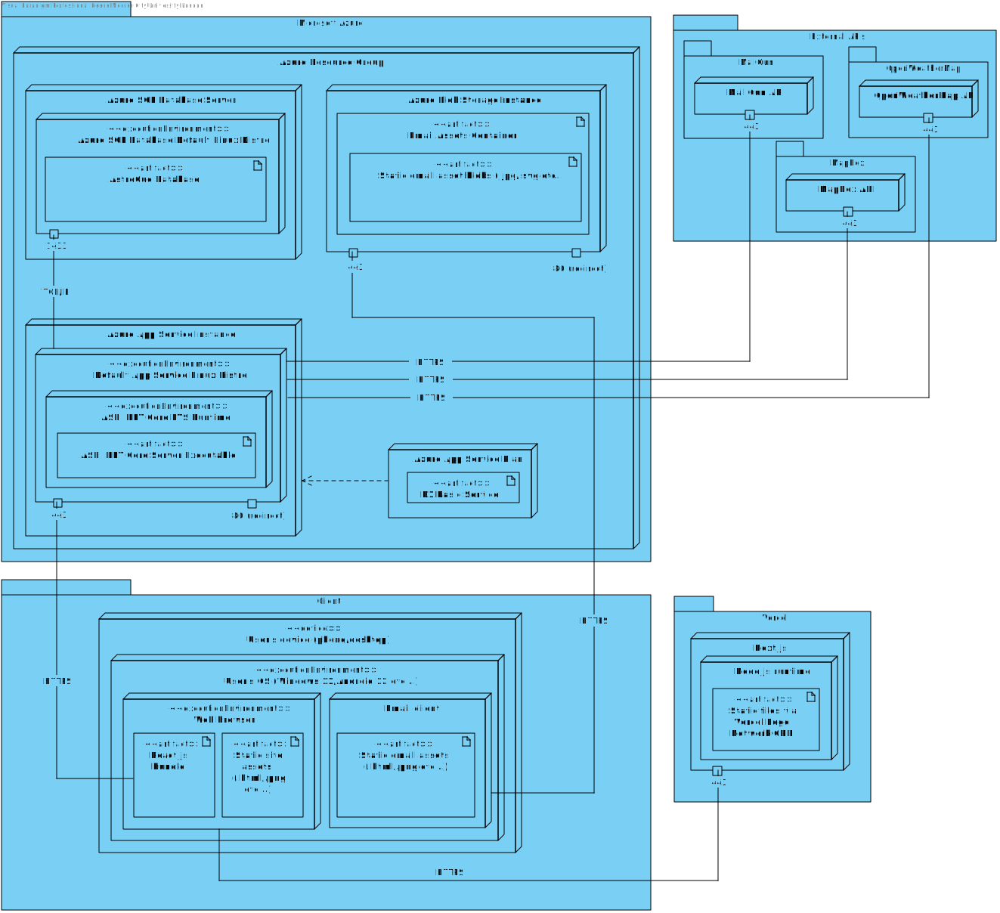
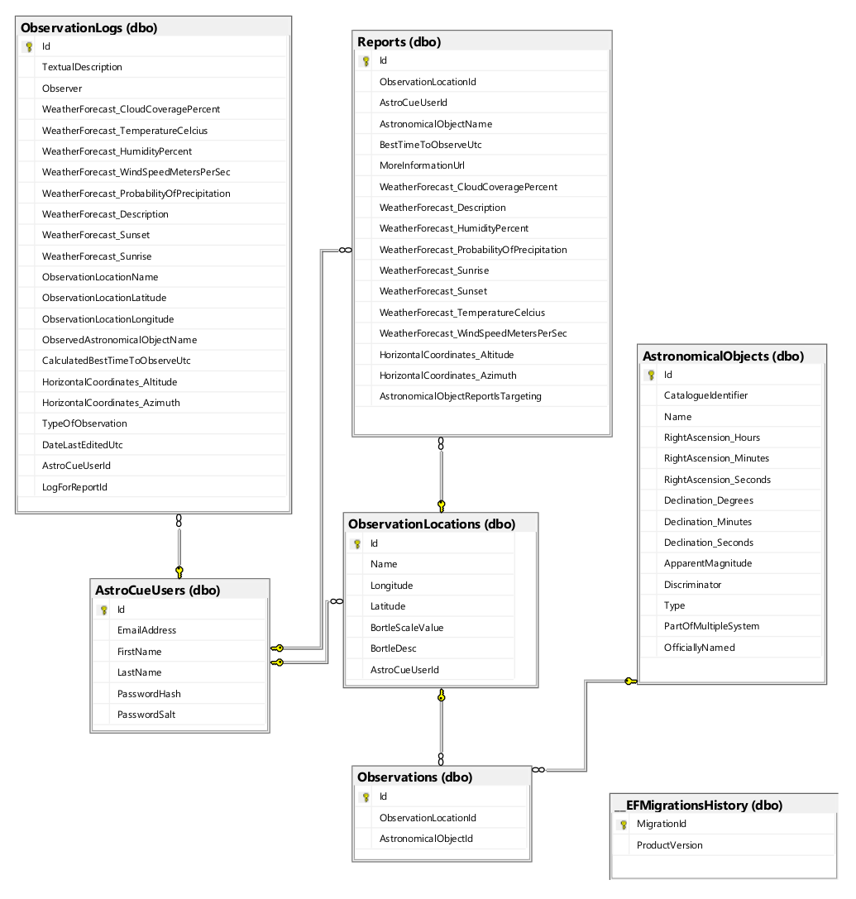

# AstroCue Server

🎓 **This repo forms a part of my university dissertation that received a final mark of 91%.**

---

### Dissertation title: _"AstroCue: planning and logging astronomical observations via computational astronomy, open data, and public APIs"_.

---

The overwhelmingly large majority of the project's logic and interesting implementation details are housed in this repo, the client was very passive, as is typically the case.

---

&nbsp;

# Table of contents

1. [Project goal](#project-goal)
2. [Project architecture](#project-architecture)
   1. [Design patterns](#design-patterns)
   2. [MVC vs. MVC(S) diagram](#mvcs-diagram)
   3. [Class diagram](#class-diagram)
3. [Deployment](#deployment)
   1. [Entity Relationship Diagram](#erd)

---

&nbsp;

# 1. Project goal (from dissertation document)

_"The main objective of AstroCue was to provide a set of integrated and unified web facilities for the automated planning and subsequent user logging of astronomical observations."_

_"It would consider geographic and celestial coordinates, local time, weather, and light pollution data to provide predicted best viewing times over a short upcoming period, and then allow users to log any
observations that were made."_

# 2. Project architecture

Overall, AstroCue was a distributed client-server system. The server (this repository) is an ASP .NET Core web API (C#), and the [AstroCue Client](https://github.com/Reeceeboii/AstroCue-Client) was a Next.js/React application (TypeScript).

### 2.1 Design patterns

In the broadest sense, AstroCue followed the MVC (Model-View-Controller) pattern, but with a view noteworthy alterations:

- The **view** layer was actually a separate codebase on a separate domain (see the [AstroCue Client](https://github.com/Reeceeboii/AstroCue-Client)).
- The server, on top of **models** and **controllers**, introduced a **service** layer. This layer housed data access code and a large portion of the business logic. These service classes were specific to a task (i.e. `EmailService` or `UserService`, and had accompanying interfaces such as `IEmailService` and `IUserService`). These service classes were reusable and maintainable as they were fine grained and had their concrete behaviors offered to client classes through their interfaces that were registered with a dependency injection container.

  _This is similar to Martin Fowler's [P of EAA Catalog - Service Layer](https://martinfowler.com/eaaCatalog/serviceLayer.html)._

### 2.2 MVC vs. MVC(S) diagram

_(Service layer in red)_

### 2.3 Class diagram

The server contains many classes across many packages, and during planning, a class diagram was created to aid the structure as the codebase grew. While the actual structure ended up being slightly different than what is depicted here, it adhered enough to still represent the state on a large scale.

_(SVG image - open in new tab and zoom for details. Quality will not be lost)._

#### 2.4 Package overview (clickable links)

- [`Entities`](https://github.com/Reeceeboii/AstroCue-Server/tree/master/AstroCue.Server/Entities) | '**M**odels' from **M**VC
- [`Controllers`](https://github.com/Reeceeboii/AstroCue-Server/tree/master/AstroCue.Server/Controllers) | **C** from MV**C**
- [`Core`](https://github.com/Reeceeboii/AstroCue-Server/tree/master/AstroCue.Server/Services) | Integral parts of an ASP .NET Core web API
- [`Astronomy`](https://github.com/Reeceeboii/AstroCue-Server/tree/master/AstroCue.Server/Astronomy) | Computational astronomy calculations
- [`Services`](https://github.com/Reeceeboii/AstroCue-Server/tree/master/AstroCue.Server/Services) | Services as mentioned in section [2.1](#design-patterns)
- [`Data`](https://github.com/Reeceeboii/AstroCue-Server/tree/master/AstroCue.Server/Services) |

## 3. Deployment

The server was deployed to Microsoft Azure. It consisted of an App Service instance, a database (Azure SQL Server), and a blob storage instance. The App Service was where the server executable itself ran, the database was where it persisted all of its data, and the blob storage was somewhat separate, serving as a hosting area for resources (images etc...) delivered via emails to users.

Below is a deployment diagram representing this setup. It also includes the third party APIs and an example of a client.

_(SVG image - open in new tab and zoom for details. Quality will not be lost)._

### 3.1 Entity Relationship Diagram

Below is the Entity Relationship Diagram created by Microsoft SQL Server Management Studios that shows the different database tables comprising the production database. Note there are several tables created by [Hangfire](https://github.com/HangfireIO/Hangfire) that aren't included for brevity.

- `AstroCueUsers` | Users table
- `Observations` | Astronomical observations (between locations and objects)
- `__EFMigrationsHistory` | Migration history stored by Entity Framework Core
- `AstronomicalObjects`

[Back to top](#top)
