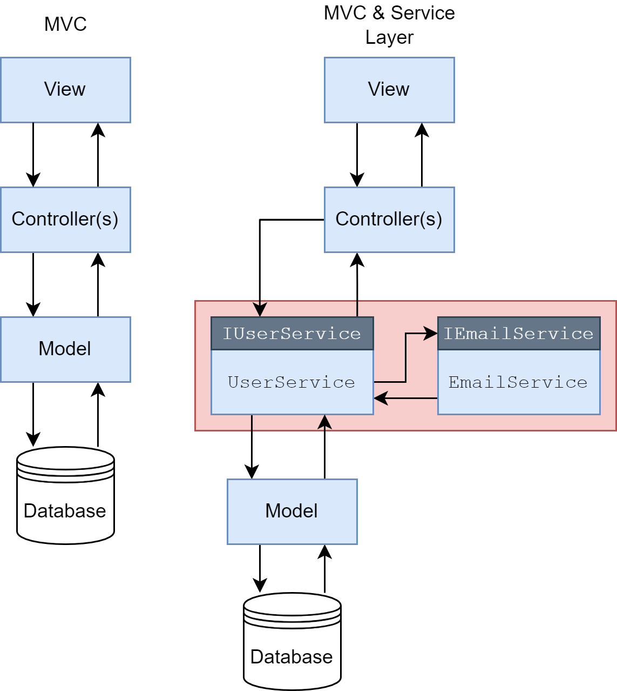
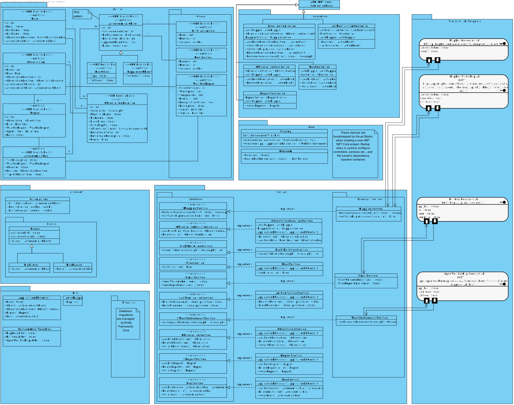
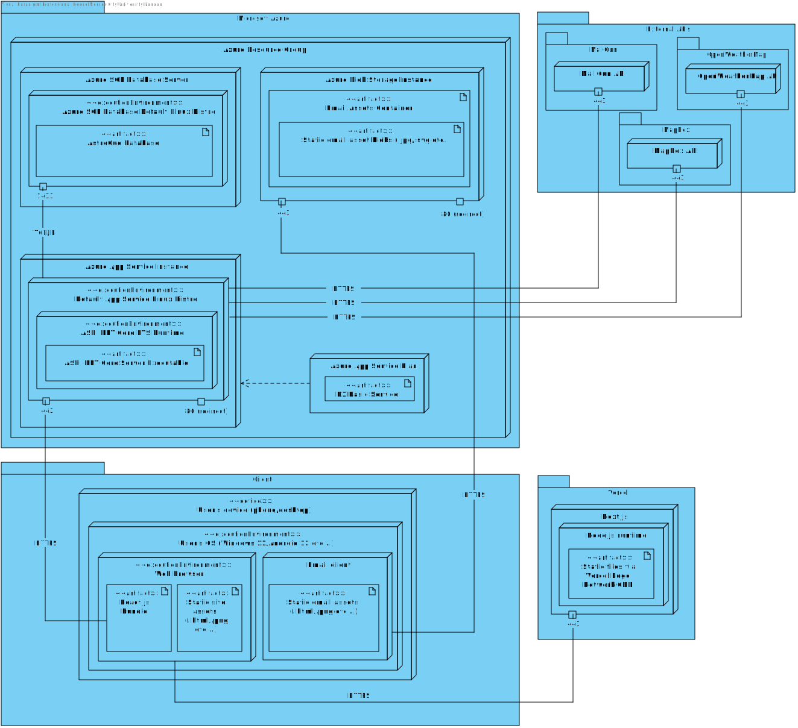
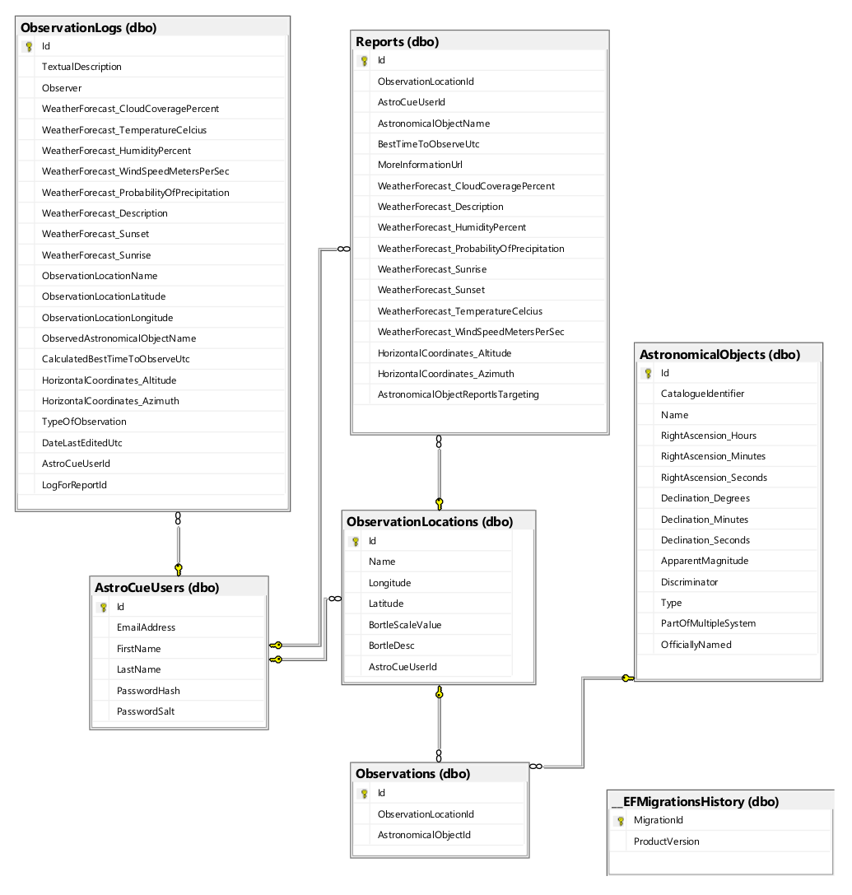
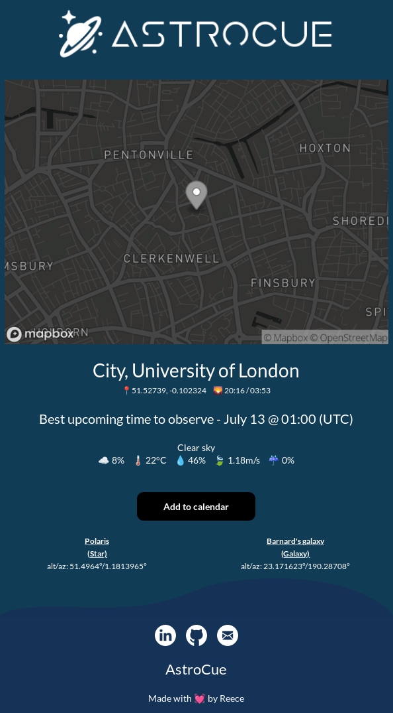

## _Planning and logging astronomical observations via computational astronomy, open data, and public APIs._

## 🎓 This repo forms a part of my university dissertation that received a final mark of 91%.

### My final dissertation document can be downloaded using the following link. Please note that this document has been purposely exported with navigation data and clickable cross references to make reading easier. To make use of these, the file is best viewed in a web browser or a dedicated PDF reader as they cannot be used in GitHub's native viewer.

[AstroCue.pdf](./AstroCue.Server/Res/README-resources/Documents/AstroCue.pdf)

---

# Table of contents

1. [Project goal](#project-goal)
2. [Project architecture](#project-architecture)
   1. [Design patterns](#design-patterns)
   2. [MVC vs. MVC(S) diagram](#mvcs-diagram)
   3. [Class diagram](#class-diagram)
3. [Deployment](#deployment)
   1. [Deployment diagram](#deployment-diagram)
   2. [Entity Relationship Diagram](#erd)
4. [Reports and computational astronomy](#reports&astro)
   1. [Report emails](#reports)
   2. [Computational astronomy](#astri)
5. [Quick source tree links](#links)

---

# 1. Project goal (from dissertation document)

_"The main objective of AstroCue was to provide a set of integrated and unified web facilities for the automated planning and subsequent user logging of astronomical observations."_

_"It would consider geographic and celestial coordinates, local time, weather, and light pollution data to provide predicted best viewing times over a short upcoming period, and then allow users to log any
observations that were made."_

---

# 2. Project architecture

Overall, AstroCue was a distributed client-server system. The server (this repository) is an ASP .NET Core web API (C#), and the [AstroCue Client](https://github.com/Reeceeboii/AstroCue-Client) was a Next.js/React application (TypeScript).

### 2.1 Design patterns

In the broadest sense, AstroCue followed the MVC (Model-View-Controller) pattern, but with a view noteworthy alterations:

- The **view** layer was actually a separate codebase on a separate domain (see the [AstroCue Client](https://github.com/Reeceeboii/AstroCue-Client)).
- The server, on top of **models** and **controllers**, introduced a **service** layer. This layer housed data access code and a large portion of the business logic. These service classes were specific to a task (i.e. `EmailService` or `UserService`, and had accompanying interfaces such as `featuresEmailService` and `IUserService`). These service classes were reusable and maintainable as they were fine grained and had their concrete behaviors offered to client classes through their interfaces that were registered with a dependency injection container.

  _This is similar to Martin Fowler's [P of EAA Catalog - Service Layer](https://martinfowler.com/eaaCatalog/serviceLayer.html)._

---

### 2.2 MVC vs. MVC(S) diagram

---

### 2.3 Class diagram

The server contains many classes across many packages, and during planning, a class diagram was created to aid the structure as the codebase grew. While the actual structure ended up being slightly different than what is depicted here, it adhered enough to still represent the state on a large scale.

_(SVG image - open in new tab and zoom for details. Quality will not be lost)._

---

#### 2.4 Package overview (clickable links)

- [`Entities`](https://github.com/Reeceeboii/AstroCue-Server/tree/master/AstroCue.Server/Entities) | '**M**odels' from **M**VC
- [`Controllers`](https://github.com/Reeceeboii/AstroCue-Server/tree/master/AstroCue.Server/Controllers) | **C** from MV**C**
- [`Core`](https://github.com/Reeceeboii/AstroCue-Server/tree/master/AstroCue.Server/) | Integral parts of an ASP .NET Core web API
- [`Astronomy`](https://github.com/Reeceeboii/AstroCue-Server/tree/master/AstroCue.Server/Astronomy) | Computational astronomy calculations
- [`Services`](https://github.com/Reeceeboii/AstroCue-Server/tree/master/AstroCue.Server/Services) | Services as mentioned in section [2.1](#design-patterns)
- [`Data`](https://github.com/Reeceeboii/AstroCue-Server/tree/master/AstroCue.Server/Data) |

---

## 3. Deployment

The server was deployed to Microsoft Azure. It consisted of an App Service instance, a database (Azure SQL Server), and a blob storage instance. The App Service was where the server executable itself ran, the database was where it persisted all of its data, and the blob storage was somewhat separate, serving as a hosting area for resources (images etc...) delivered via emails to users.

Below is a deployment diagram representing this setup. It also includes the third party APIs and an example of a client.

### 3.1 Deployment diagram

---

### 3.2 Entity Relationship Diagram

Below is the Entity Relationship Diagram created by Microsoft SQL Server Management Studios that shows the different database tables comprising the production database. Note there are several tables created by [Hangfire](https://github.com/HangfireIO/Hangfire) that aren't included for brevity.

- `AstroCueUsers` | Users table
- `Observations` | Astronomical observations (between locations and objects)
- `__EFMigrationsHistory` | Migration history stored by Entity Framework Core
- `AstronomicalObjects` | Stars and deep sky objects (>125,000 rows)
- `ObservationLocations` | Locations added by users denoting where they go to observe
- `ObservationLogs` | Stores observation logs created by users against `Reports`
- `Reports` | Stores observation reports generated by AstroCue's algorithms

---

## 4. Observation reports and computational astronomy

The main purpose of AstroCue was to provide users with reports about when the best time to observe certain objects would be based on the relative conditions of the next few days at their observation locations. The main form of the reports were periodic emails sent to the email addresses that users used when signing up.

The server automatically generates and sends out these emails at 16:00 UTC every Monday and Thursday, but users can also request for their reports to be generated on demand. For each `observation` (a combination of one of their observation locations and an astronomical object) owned by a given user, a single report would be generated. All of the reports for a given run are collated and sent in a single email.

### 4.1 Report emails

Observation report emails look as follows:

### 4.2 Computational astronomy

At the core of the computational astronomy algorithms implemented by AstroCue is a transformation between the equatorial and horizontal coordinate systems.

For an introduction to these systems, a section of my report has been exported for easy access and can be found here:

[Introduction to Celestial Coordinate Systems.pdf](./AstroCue.Server/Res/README-resources/Documents/Introduction%20to%20Celestial%20Coordinate%20Systems.pdf)

---

## 5. Quick source tree links

Use these links to quickly navigate to a point of interest in the repository.

- #### 💉 **Dependency injection** - [Container setup](https://github.com/Reeceeboii/AstroCue-Server/blob/abe5a4d2d33410a34dc52a46e416b5a4478a060a/AstroCue.Server/Startup.cs#L154-L188) | [Example client](https://github.com/Reeceeboii/AstroCue-Server/blob/abe5a4d2d33410a34dc52a46e416b5a4478a060a/AstroCue.Server/Services/ReportService.cs#L57-L62)
- #### 💃 [**Models**](https://github.com/Reeceeboii/AstroCue-Server/tree/master/AstroCue.Server/Entities) - (**M**VC) - referred to as 'entities' in this codebase
- #### 🎮 [**Controllers**](https://github.com/Reeceeboii/AstroCue-Server/tree/master/AstroCue.Server/Controllers) - (MV**C**)
- #### 🌟 **Computational astronomy** - [Celestial coordinate transforms](https://github.com/Reeceeboii/AstroCue-Server/blob/master/AstroCue.Server/Astronomy/CoordinateTransformations.cs) | [Diurnal motion](https://github.com/Reeceeboii/AstroCue-Server/blob/abe5a4d2d33410a34dc52a46e416b5a4478a060a/AstroCue.Server/Services/ObservationService.cs#L107-L153)
- #### 💡 [**Light pollution calculations**](https://github.com/Reeceeboii/AstroCue-Server/blob/master/AstroCue.Server/Astronomy/BortleScale.cs) using the Bortle Scale
- ### ⚙️ Services for:
  - #### ✉️ [**Sending emails**](https://github.com/Reeceeboii/AstroCue-Server/blob/master/AstroCue.Server/Services/EmailService.cs) via the MailGun API
  - #### 🗺️ [**Retrieving mapping data**](https://github.com/Reeceeboii/AstroCue-Server/blob/master/AstroCue.Server/Services/MappingService.cs) via the MapBox API
  - #### 🌧️ [**Retrieving weather data**](https://github.com/Reeceeboii/AstroCue-Server/blob/master/AstroCue.Server/Services/WeatherForecastService.cs) via the OpenWeatherMap API
  - #### 💡 [**Calculating arbitrary light pollution levels**](https://github.com/Reeceeboii/AstroCue-Server/blob/master/AstroCue.Server/Services/LightPollutionService.cs)
  - #### 📋 [**Generating AstroCue's reports**](https://github.com/Reeceeboii/AstroCue-Server/blob/master/AstroCue.Server/Services/ReportService.cs)
- #### 🗂️ [**Parsing astronomical catalogues**](https://github.com/Reeceeboii/AstroCue-Server/tree/master/AstroCue.Server/Data/Parsers)
- #### 💾 [**EF Core database context**](https://github.com/Reeceeboii/AstroCue-Server/blob/master/AstroCue.Server/Data/ApplicationDbContext.cs)

---

&nbsp;

## ⬆️ [Back to top](#top) ⬆️
